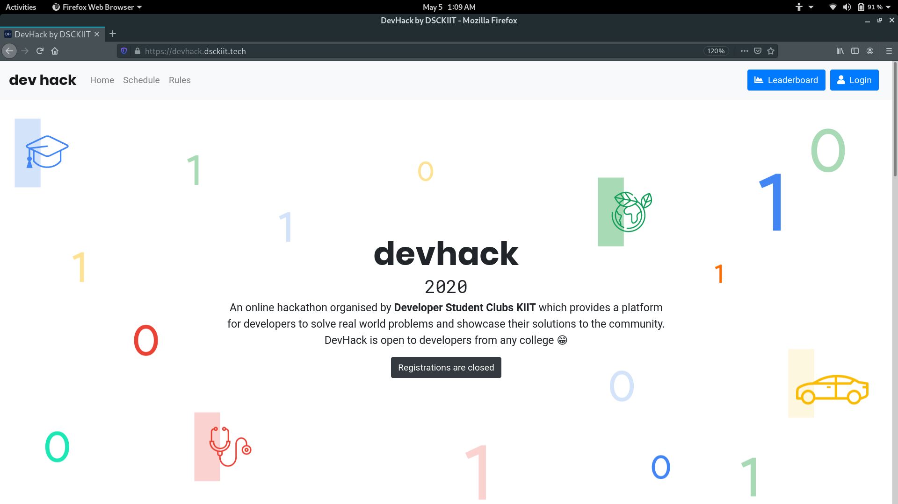
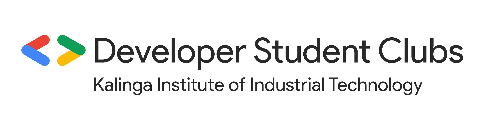

# DevHack 2020 🧑🏻‍🚀🚀

**DevHack** is an online Hackathon organised by **Developer Student Clubs - Kalinga Institute of Industrial Technology** for all those
problem solvers and creators out there who are ready to take up a challenge and showcase their skills by as innovative as possible. 

This repository contains all the code and database scripts for the website.

    
    

## Build Status

## Code Style

We have used the standard [Prettier](https://prettier.io/) config that comes already loaded with GatsbyJS

## Technologies and Frameworks 

Built using [GatsbyJS](https://www.gatsbyjs.org/) to leverage server side rendering. Used [Firebase](https://firebase.google.com/) for authentication, database and hosting.

The repository has CI/CD activated. Every commit pushed to `master` is built and deployed. You can have a look 
at the `.github/workflows/build.yml` file for the CI specification.

## Development

Follow the following instructions to set up your dev environment. You can find a list of all the dependencies in [package.json](package.json)

* `npm install` to install all the dependencies
* `npm start` to build and view the site on `localhost:8000`
* `npm run build` to build to static assets

## Screenshots

    

 

## LICENSE
Copyright (c) **DSC KIIT**. All rights reserved. Licensed under the MIT License

    

